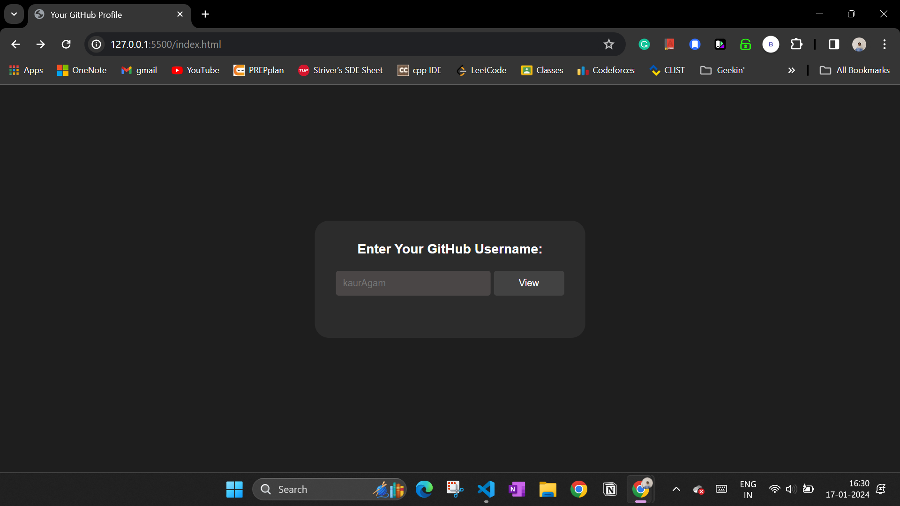
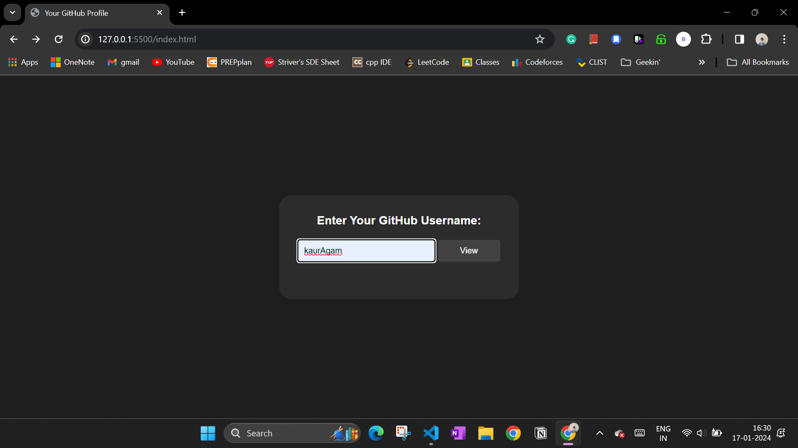

# GitHub-Repositories-listing-page

This is a simple web application that allows users to view their GitHub profile information and repositories. Users can enter their GitHub username, and the application will fetch and display their profile details, including a circular profile picture, name, bio, and other relevant information.

## Getting Started

Clone the repository to your local machine and open the `index.html` file in a web browser to launch the application.

## Usage

1. Enter your GitHub username in the provided input field.
2. Click the "View" button to fetch and display your GitHub profile information.
3. The left side of the page displays a circular profile picture, and the right side shows your name, bio, GitHub link, followers, and following count.
4. Scroll down to view a list of your GitHub repositories, including repository name, description, language, stars, and forks.

## Technologies Used

- HTML5
- CSS3
- JavaScript
- jQuery
- GitHub API

## Screenshots

## Customization

You can customize the appearance and styles by modifying the CSS file (`css/styles.css`). Feel free to make adjustments to match your preferences.

## Contributing

Contributions are welcome! If you have any suggestions, bug reports, or enhancements, please create an issue or submit a pull request.

## License

This project is licensed under the MIT License - see the [LICENSE](LICENSE) file for details.
